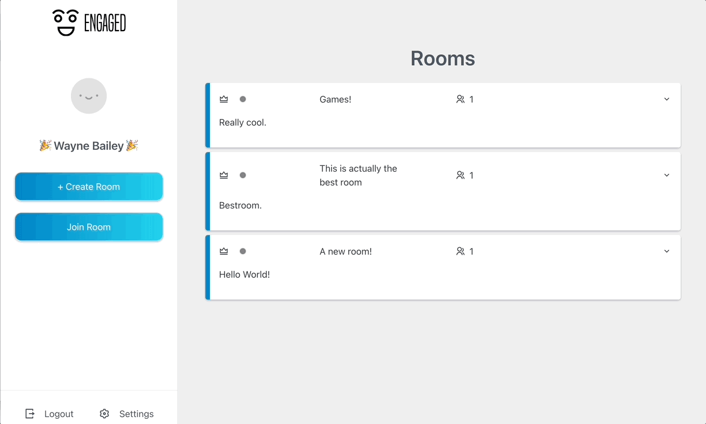
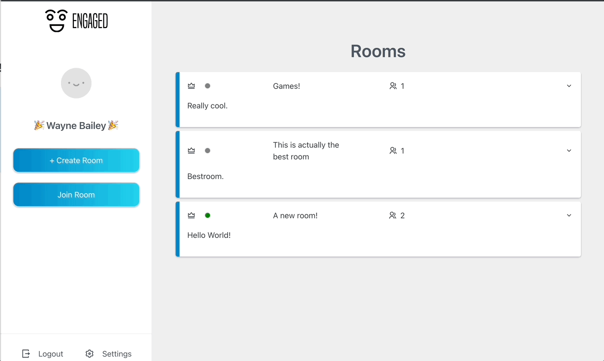

# Engaged App - Frontend

Engaged - Umbrella Project for Develop Carolina apprenticeship.

[itrytocodethings](https://github.com/itrytocodethings) / [
ShaunR23](https://github.com/ShaunR23)

# MVP
 - Room based application.
 - Create/Join/Share rooms with others.
 - "Icebreakers" gamemode as example for MVP Demo.
 - Room host/creator can change room state from default lobby (chat) to icebreakers gamemode.
 - Real time interactions - Socket.IO

 # Icebreakers example gamemode.
 The idea was to have a small game to play when on a remote teams/zoom call. When the host starts an icebreakers game, the application determines all **active** users in the room and excludes users that are *members* of the room but are offline. The host controls when to move on to the next user. If all users have been selected for a particular question, a new question gets pulled and will continue to iterate over the active users. 

 # Tech Stack
 - MondoDB
 - Express/Node (Backend)
 - React
 - Socket.IO
 - Prisma
 - Firebase Auth.
 - Docker (Backend)

 # Screenshots 
 ## Creating Rooms
 

 ## Room Invite
 

 ## Active/Inactive room idicators on room cards.
 

 ## Host Starting Icebreakers
 